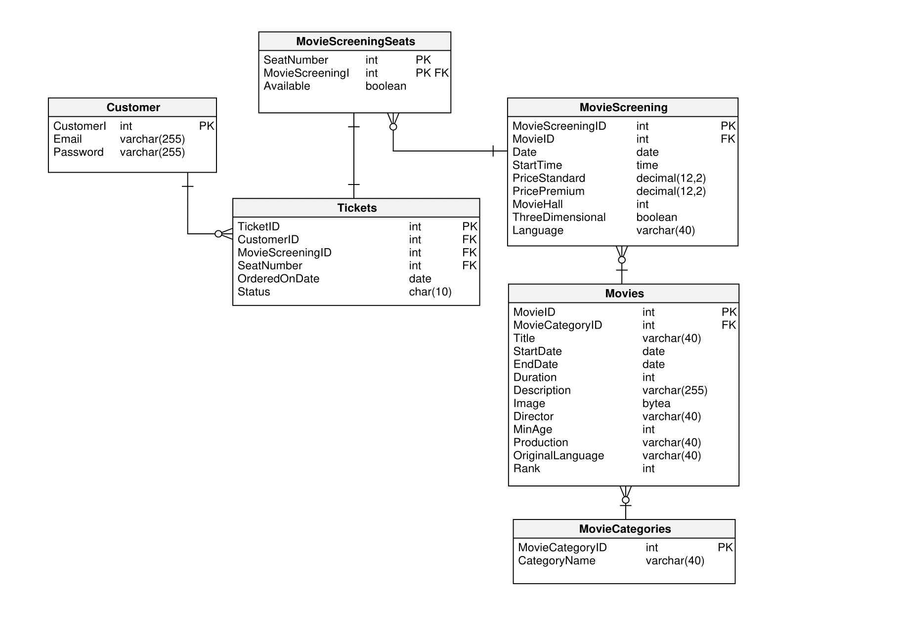

# KONIECZNIE OGARNĄĆ AUTOMATYCZNE DODAWANIE PRIMARY KEY
# Trzeba ogarnąć jak zrobić wybieranie dostępnych miejsc (Można to zrobić za pomocą widoku lub funkcji)

# Bazy danych 2 Projekt

## 1. **Opis projektu**

W ramach projektu została stworzona strona kina z możliwością rejestracji, logowania się na stronie, rezerwacją i zakupem biletów na dostępne seansy.

## 2. **Schemat bazy danych**



## 3. **Tabele**

```sql
-- Table: MovieCategories
CREATE TABLE MovieCategories (
    MovieCategoryID int  NOT NULL,
    CategoryName varchar(40)  NOT NULL,
    CONSTRAINT MovieCategories_pk PRIMARY KEY (MovieCategoryID)
);

-- Table: MovieScreening
CREATE TABLE MovieScreening (
    MovieScreeningID int  NOT NULL,
    MovieID int  NOT NULL,
    Date date  NOT NULL,
    StartTime time  NOT NULL,
    PriceStandard decimal(12,2)  NOT NULL,
    PricePremium decimal(12,2)  NOT NULL,
    MovieHall int  NOT NULL,
    ThreeDimensional boolean  NOT NULL,
    Language varchar(40)  NOT NULL,
    CONSTRAINT MovieScreening_pk PRIMARY KEY (MovieScreeningID)
);

-- Table: MovieScreeningSeats
CREATE TABLE MovieScreeningSeats (
    SeatNumber int  NOT NULL,
    MovieScreeningID int  NOT NULL,
    Available boolean  NOT NULL,
    CONSTRAINT MovieScreeningSeats_pk PRIMARY KEY (MovieScreeningID,SeatNumber)
);

-- Table: Movies
CREATE TABLE Movies (
    MovieID int  NOT NULL,
    MovieCategoryID int  NOT NULL,
    Title varchar(40)  NOT NULL,
    StartDate date  NOT NULL,
    EndDate date  NOT NULL,
    Duration int  NOT NULL,
    Description varchar(255)  NOT NULL,
    Image bytea  NOT NULL,
    Director varchar(40)  NOT NULL,
    MinAge int  NOT NULL,
    Production varchar(40)  NOT NULL,
    OriginalLanguage varchar(40)  NOT NULL,
    Rank int  NOT NULL,
    CONSTRAINT Movies_pk PRIMARY KEY (MovieID)
);

-- Table: Tickets
CREATE TABLE Tickets (
    TicketID int  NOT NULL,
    CustomerID int  NOT NULL,
    MovieScreeningID int  NOT NULL,
    SeatNumber int  NOT NULL,
    OrderedOnDate date  NOT NULL,
    Status char(10)  NOT NULL,
    CONSTRAINT Tickets_pk PRIMARY KEY (TicketID)
);

-- foreign keys
-- Reference: MovieScreeningPlaces_MovieScreening (table: MovieScreeningSeats)
ALTER TABLE MovieScreeningSeats ADD CONSTRAINT MovieScreeningPlaces_MovieScreening
    FOREIGN KEY (MovieScreeningID)
    REFERENCES MovieScreening (MovieScreeningID)  
    NOT DEFERRABLE 
    INITIALLY IMMEDIATE
;

-- Reference: Session_Movies (table: MovieScreening)
ALTER TABLE MovieScreening ADD CONSTRAINT Session_Movies
    FOREIGN KEY (MovieID)
    REFERENCES Movies (MovieID)  
    NOT DEFERRABLE 
    INITIALLY IMMEDIATE
;

-- Reference: Tickets_MovieScreeningSeats (table: Tickets)
ALTER TABLE Tickets ADD CONSTRAINT Tickets_MovieScreeningSeats
    FOREIGN KEY (MovieScreeningID, SeatNumber)
    REFERENCES MovieScreeningSeats (MovieScreeningID, SeatNumber)  
    NOT DEFERRABLE 
    INITIALLY IMMEDIATE
;

-- Reference: client_purchase (table: Tickets)
ALTER TABLE Tickets ADD CONSTRAINT client_purchase
    FOREIGN KEY (CustomerID)
    REFERENCES Appuser (user_id)  
    NOT DEFERRABLE 
    INITIALLY IMMEDIATE
;

-- Reference: product_category_product (table: Movies)
ALTER TABLE Movies ADD CONSTRAINT product_category_product
    FOREIGN KEY (MovieCategoryID)
    REFERENCES MovieCategories (MovieCategoryID)  
    NOT DEFERRABLE 
    INITIALLY IMMEDIATE
;
```

## 4. **Widoki**

- Widok pokazujący dostępne miejsca na wszystkie seansy

```postgresql
create view availableseats(id, seatnumber, moviescreeningid) as
SELECT row_number() OVER (ORDER BY moviescreeningid, seatnumber) AS id,
       seatnumber,
       moviescreeningid
FROM moviescreeningseats
WHERE available = true;

alter table availableseats
    owner to postgres;
```

## 5. **Procedury**

- Rezerwacja miejsca na określony seans

```postgresql
CREATE OR REPLACE PROCEDURE reserve_movie_screening_seat(
    IN p_seat_number INTEGER,
    IN p_movie_screening_id INTEGER
)
LANGUAGE plpgsql
AS $$
BEGIN
    UPDATE moviescreeningseats
    SET available = FALSE
    WHERE seatnumber = p_seat_number AND moviescreeningid = p_movie_screening_id;
END;
$$;
```

## 6. **Funkcje**

- Wyświetlenie wszystkich seansów dla danego movie, które są grane po wskazywanym terminie

```postgresql
CREATE OR REPLACE FUNCTION get_movie_sessions(movie_id integer, target_date date, target_time time)
RETURNS TABLE (
    moviescreeningid integer,
    movieid integer,
    date date,
    starttime time,
    pricestandard numeric(12, 2),
    pricepremium numeric(12, 2),
    moviehall integer,
    threedimensional boolean,
    language varchar(40)
) AS $$
BEGIN
    RETURN QUERY
    SELECT
        moviescreening.moviescreeningid,
        moviescreening.movieid,
        moviescreening.date,
        moviescreening.starttime,
        moviescreening.pricestandard,
        moviescreening.pricepremium,
        moviescreening.moviehall,
        moviescreening.threedimensional,
        moviescreening.language
    FROM
        moviescreening
    WHERE
        moviescreening.movieid = get_movie_sessions.movie_id
        AND moviescreening.date >= get_movie_sessions.target_date
        AND (moviescreening.date > get_movie_sessions.target_date OR moviescreening.starttime >= get_movie_sessions.target_time);
END;
$$ LANGUAGE plpgsql;
```

- Wyświetlenie wszystkich wolnych miejsc dla danego seansu

```postgresql
CREATE OR REPLACE FUNCTION get_available_seats(screening_id integer)
RETURNS TABLE (
    seat_number integer
) AS $$
BEGIN
    RETURN QUERY
    SELECT
        seatnumber AS seat_number
    FROM
        availableseats
    WHERE
        moviescreeningid = get_available_seats.screening_id;
END;
$$ LANGUAGE plpgsql;
```

## 7. **Triggery**

- Dodawanie nowego rekordu do tabeli Tickets po rezerwacji miejsca

```postgresql
CREATE OR REPLACE FUNCTION update_moviescreeningseats_trigger()
RETURNS TRIGGER AS $$
BEGIN
    IF NEW.available = FALSE AND OLD.available = TRUE THEN
        INSERT INTO tickets (customerid, moviescreeningid, seatnumber, orderedondate, status)
        VALUES (6, NEW.moviescreeningid, NEW.seatnumber, CURRENT_DATE, 'New');
    END IF;

    RETURN NEW;
END;
$$ LANGUAGE plpgsql;
```

```postgresql
CREATE OR REPLACE TRIGGER update_moviescreeningseats_trigger
AFTER UPDATE OF available ON moviescreeningseats
FOR EACH ROW
EXECUTE FUNCTION update_moviescreeningseats_trigger();
```

## 8. **Indeksy**

## 9. **Widoki strony internetowej**