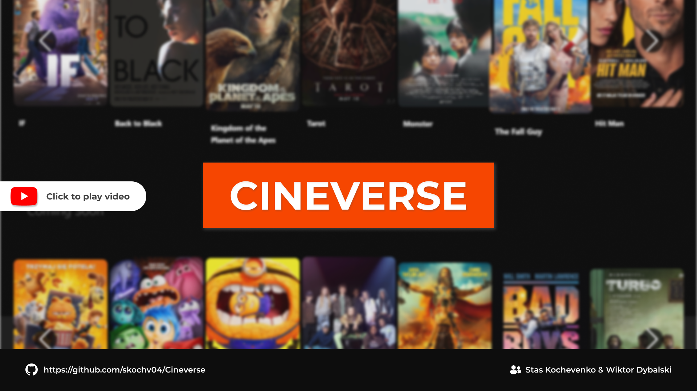

# 🎬 Cineverse

A Python-based full-stack cinema web application, developed as part of the 4th semester of studies at AGH.

## 👥 Team Members:
- **Stas Kochevenko** | skochv04@gmail.com  
- **Wiktor Dybalski**

## 📌 Project Overview:
Cineverse is a web application that allows users to:  
✅ Reserve seats  
✅ Purchase tickets  
✅ Cancel bookings  

It provides an intuitive and user-friendly interface for both moviegoers and cinema operators.

## 🛠️ Technologies Used:
- **Database Server**: PostgreSQL  
- **Frontend Framework**: React.js  
- **Backend Framework**: Django (Python)  

[](https://youtu.be/ba-O6UYtpy8)

## 🚀 How to Run the Application?

### 1️⃣ Install dependencies
```bash
cd server
pip install -r requirements.txt
```

### 2️⃣ Set up the database
- Start PostgreSQL server
- Import the provided database schema:
```bash
psql -U your_username -d your_database -f CinemaDatabase.sql
```

### 3️⃣ Run the backend server
```bash
cd server
python manage.py runserver
```

### 4️⃣ Run the frontend
```bash
cd client
npm install
npm run dev
```
