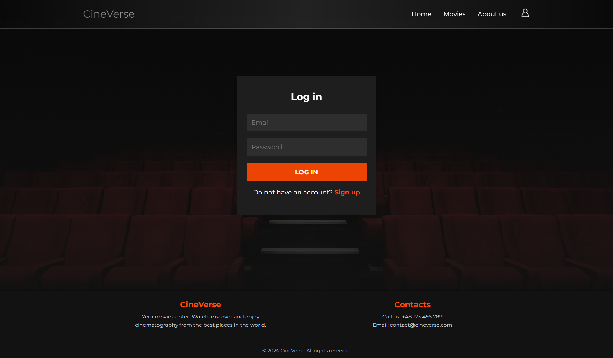
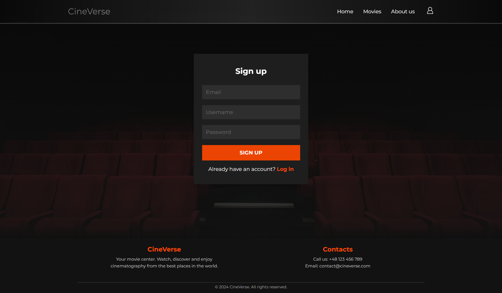
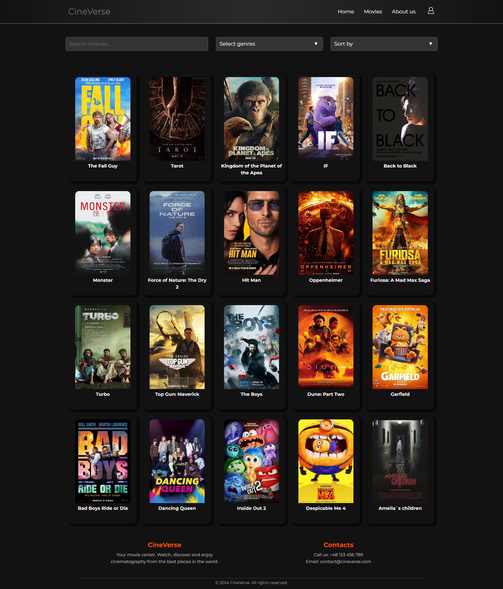
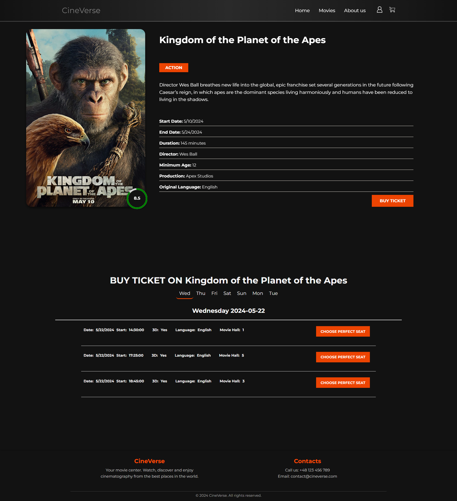
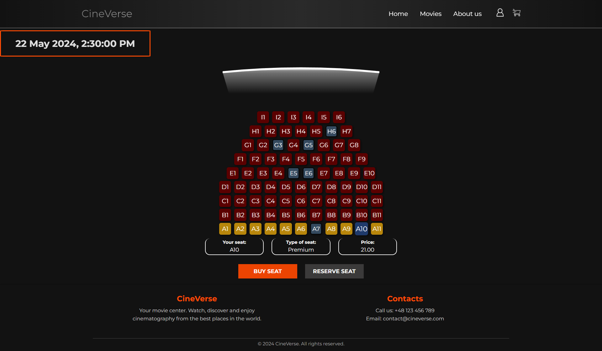
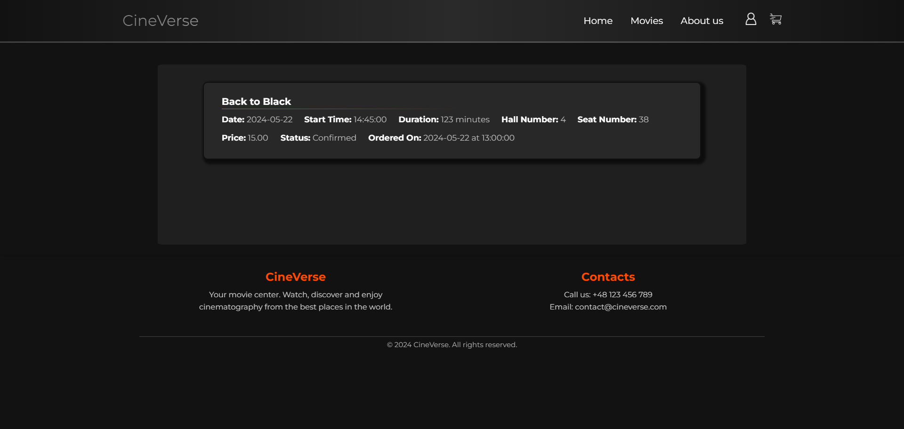
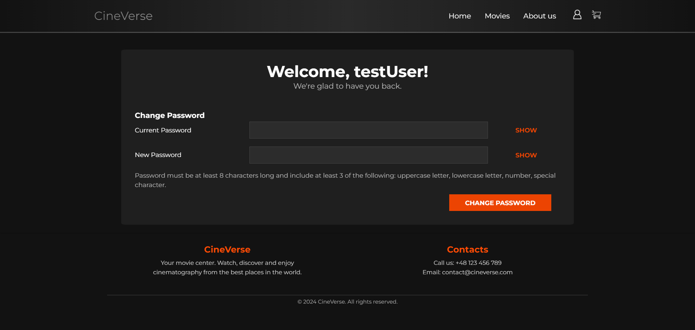
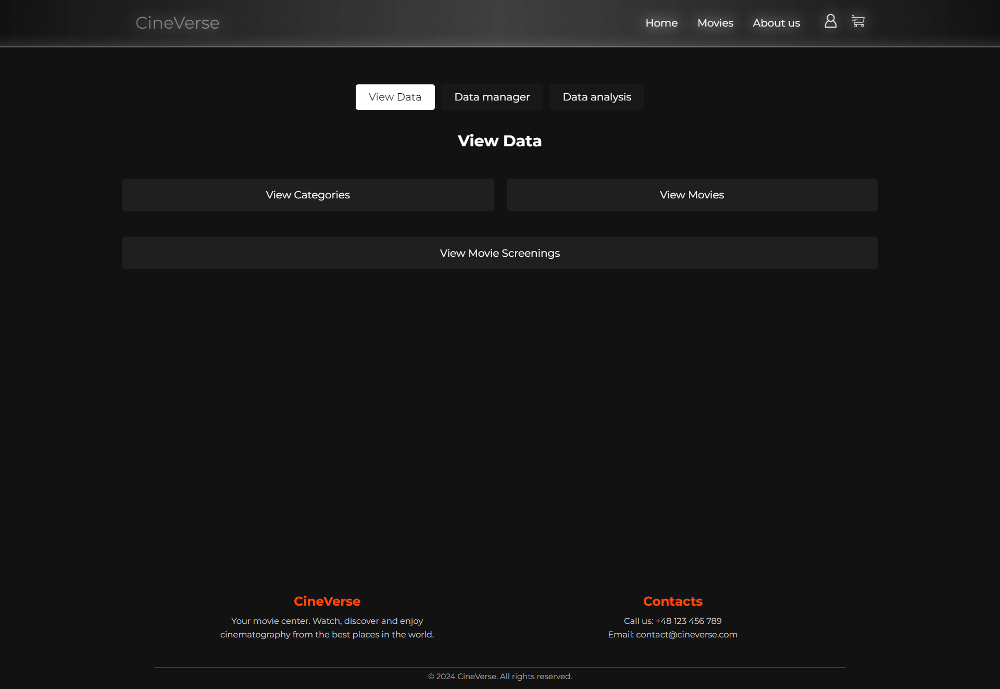
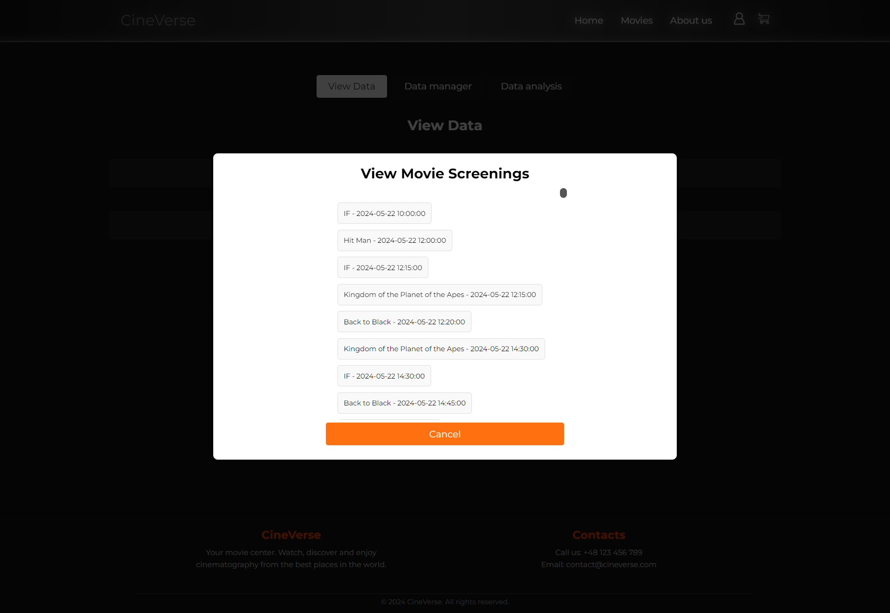
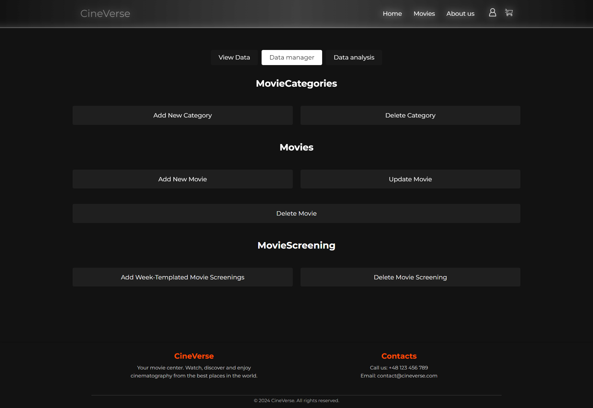

# Cineverse

Database project, carried out in the 4th semester of studies at AGH.

### Project topic: 
A full-stack cinema web application that allows users to reserve seats, purchase tickets, and cancel bookings. It features a user-friendly interface for both moviegoers and cinema operators.

### Technology:
   - Data base server: PostgreSQL
   - Framework: React JS
   - Server part: Django (Python)

### Some images of our website:

1. Home:

2 Login:

3. Register:

4. Movies:

5. Movie details and movie showtime:

   
6. Movie Stage: 

7. My tickets:

8. My profile:

9. Admin1:

10. Admin2:

11. Admin3:

12. Admin4:

